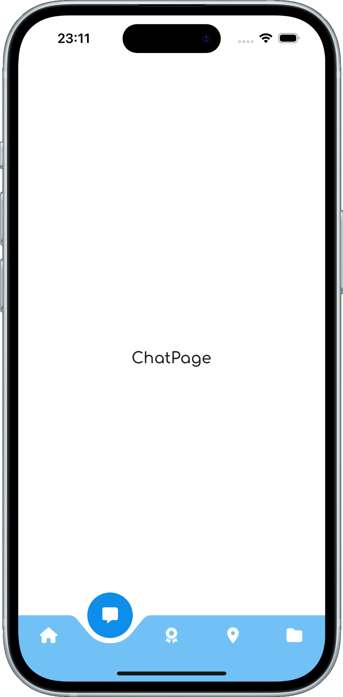

# Navbar Animation #1

**.NET MAUI** implementation of [Navbar Animation #1](https://dribbble.com/shots/9852644-Navbar-Animation-1) design by [Marie Bernard](https://dribbble.com/marie_brn).

## Original design

## My .NET MAUI implementation

The application was built using .NET MAUI APIs and my [SimpleToolkit](https://github.com/RadekVyM/SimpleToolkit) library.

    
    &nbsp;&nbsp;&nbsp;&nbsp;&nbsp;&nbsp;&nbsp;
    

### Supported platforms

These are all the platforms the app works on:

- Android
- iOS (macOS)
- Windows

### Features

- Use of [SimpleToolkit](https://github.com/RadekVyM/SimpleToolkit) library
    - `SimpleShell`
    - `ContentButton`
    - `Icon`
- `GraphicsView`
- Animations
